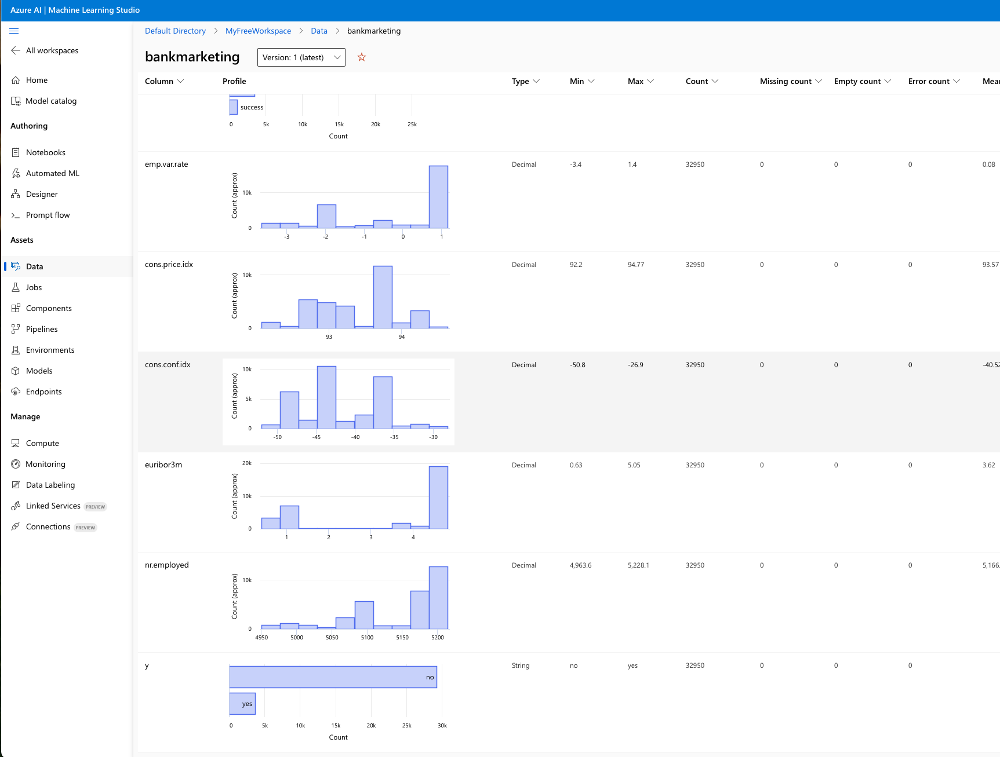
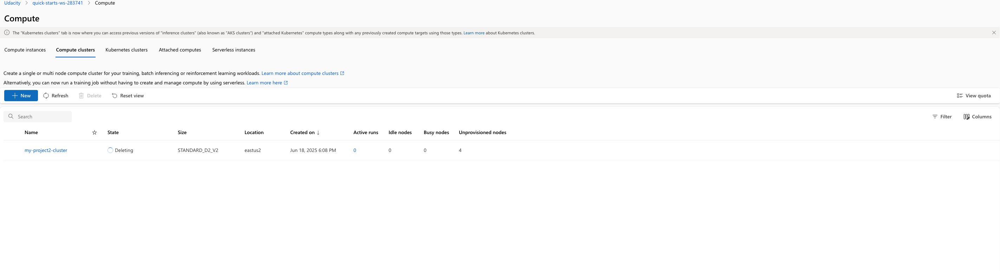

# Optimizing an ML Pipeline in Azure

## Overview
This project is part of the Udacity Azure ML Nanodegree.
In this project, we build and optimize an Azure ML pipeline using the Python SDK and a provided Scikit-learn model.
This model is then compared to an Azure AutoML run.

## Useful Resources
- [ScriptRunConfig Class](https://docs.microsoft.com/en-us/python/api/azureml-core/azureml.core.scriptrunconfig?view=azure-ml-py)
- [Configure and submit training runs](https://docs.microsoft.com/en-us/azure/machine-learning/how-to-set-up-training-targets)
- [HyperDriveConfig Class](https://docs.microsoft.com/en-us/python/api/azureml-train-core/azureml.train.hyperdrive.hyperdriveconfig?view=azure-ml-py)
- [How to tune hyperparamters](https://docs.microsoft.com/en-us/azure/machine-learning/how-to-tune-hyperparameters)

## Summary
In this project, we have a classification problem at hand, and we try to train a model to predict leads for Bank Marketing from the customer information of attributes and credit history.

The solution involves building an optimized Logistic Regression model using Azure Machine Learning's HyperDrive for hyperparameter tuning and comparing its performance against a model automatically generated by Azure AutoML. The best performing model is determined by a chosen primary metric, accuracy.  Our best model is from AutoML, a Voting Ensemble model with accuracy of 91.7% 

## Scikit-learn Pipeline
The pipeline typically begins with data ingestion and preparation, where a dataset is loaded into an Azure ML Dataset. This data is then passed to a training script. Inside the training script, the data is transformed and usually split into training and validation sets. A classification algorithm from Scikit-learn, LogisticRegression is instantiated. Hyperparameter tuning is performed using Azure ML's HyperDrive service, which iteratively trains the model with Random hyperparameter combinations defined within a search space. The HyperDrive run orchestrates these training jobs, monitoring a primary metric, accuracy to find the optimal set of hyperparameters.

A commonly chosen parameter sampler for this type of problem is RandomParameterSampling. Benefits of RandomParameterSampling is that it randomly selects combinations of hyperparameters from a defined search space. This approach is generally more efficient than GridParameterSampling for high-dimensional search spaces, as it explores more diverse regions of the parameter space, often finding a good or optimal solution faster. It's also computationally less expensive than Bayesian sampling when the number of trials is limited, making it a robust default for initial hyperparameter tuning.

A frequently used early stopping policy for HyperDrive runs is the BanditPolicy. Benefits of BanditPolicy is that this policy allows for early termination of poorly performing runs, saving computational resources and time. It works by monitoring the primary metric of each run and comparing it against the best performing run. If a run's performance falls outside a specified "slack factor" or "slack amount" compared to the best run, it is terminated early. This ensures that only promising trials continue to completion, accelerating the tuning process without sacrificing the chance of finding a good model.

## AutoML
Azure AutoML automatically explores various machine learning algorithms and hyperparameter combinations to find the best model for the given task. It often identifies a robust ensemble model, VotingEnsemble or a high-performing individual algorithm like XGBoostClassifier or LightGBMClassifier, along with its optimized hyperparameters determined through an automated search.  Our best model is from AutoML, a Voting Ensemble model with accuracy of 91.7% 

## Pipeline comparison
The AutoML-generated model achieves 1% higher accuracy compared to the manually tuned LogisticRegression model. This difference in accuracy can be attributed to AutoML's comprehensive search capabilities, which explore a much broader range of algorithms and more intricate hyperparameter spaces, including ensemble methods, which are complex to build manually. The architecture of the normal pipeline is constrained by the chosen algorithm, Logistic Regression and the defined hyperparameter random space, while AutoML's architecture is dynamically determined, potentially including advanced techniques like feature engineering, model stacking, or specialized algorithms optimized for the dataset.

## Future work
Exploring different Algorithms, experimenting with other classifiers such as Gradient Boosting, Support Vector Machines during manual tuning.
We can also try Larger Hyperparameter Search Space.
Since the dataset has a huge class imbalance as we can see from the dataset profiling in AzureML studio, we can consider some Data augmentation or sampling techniques to get improved results.

## Proof of cluster clean up

